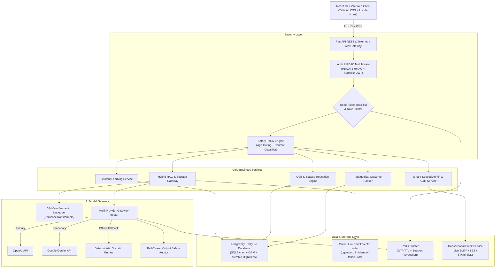

# Edufeedia

[](LICENSE)
[](LICENSE)
[](SECURITY.md)
[](CLA.md)

> **A safe, personalized learning and revision platform engineered specifically for students aged 10-17.**  
> Curating curriculum-aligned educational materials from trusted sources, personalizing daily study feeds, orchestrating fail-closed Socratic AI tutoring, and driving long-term retention through active recall, adaptive quizzes, and SM-2 spaced repetition.

---

## Table of Contents

- [1. Executive Product Overview](#1-executive-product-overview)
- [2. Key Features and Capabilities](#2-key-features-and-capabilities)
- [3. High-Level Architecture Diagram](#3-high-level-architecture-diagram)
- [4. The End-to-End Content and AI Lifecycle](#4-the-end-to-end-content-and-ai-lifecycle)
- [5. AI and Socratic RAG Engine](#5-ai-and-socratic-rag-engine)
- [6. Zero-Trust Security and Multi-Category Safety](#6-zero-trust-security-and-multi-category-safety)
- [7. Purpose-Specific Verifiable Guardian Consent Framework](#7-purpose-specific-verifiable-guardian-consent-framework)
- [8. Multi-Tenant Role-Based Access Control (RBAC)](#8-multi-tenant-role-based-access-control-rbac)
- [9. Technology Stack](#9-technology-stack)
- [10. Local Development Quickstart](#10-local-development-quickstart)
- [11. Environment Configuration Reference](#11-environment-configuration-reference)
- [12. Database Migrations (Alembic)](#12-database-migrations-alembic)
- [13. Automated Test Suite](#13-automated-test-suite)
- [14. Docker and CI/CD Deployment Architecture](#14-docker-and-cicd-deployment-architecture)
- [15. Observability and SRE Telemetry](#15-observability-and-sre-telemetry)
- [16. Product Roadmap](#16-product-roadmap)
- [17. License and Student Privacy Notice](#17-license-and-student-privacy-notice)
- [18. Contributing and Governance](#18-contributing-and-governance)
- [19. Deep-Dive System Documentation](#19-deep-dive-system-documentation)

---

## 1. Executive Product Overview

Traditional open internet search exposes K-12 students to unvetted material, distractions, and toxic content. Generic AI chat interfaces frequently hallucinate answers or act as homework-solving engines that bypass critical thinking.

**Edufeedia** addresses these challenges with a **modular, fail-closed educational platform**:
1. **Verified Curriculum Discovery**: Ingests exclusively from whitelisted, verified educational authorities (CBSE, NCERT, ICSE, Khan Academy, MIT OpenCourseWare).
2. **Pedagogical AI Tutoring**: Socratic dialogue guides students step-by-step to arrive at conceptual solutions rather than providing raw answers.
3. **Multi-Category Safety Gate**: Real-time content filtering rejects toxic material, dangerous activities, hate speech, and adversarial prompt injections.
4. **Adaptive Personalization**: Pedagogical heuristic weighted ranking with SM-2 memory decay weighting and cold-start exploration.
5. **Verifiable Guardian Consent**: Cryptographic OTP guardian verification designed with the Indian Digital Personal Data Protection (DPDP) Act 2023 principles and US COPPA parental consent safeguards in mind.

---

## 2. Key Features and Capabilities

- **Multi-Provider Socratic AI Tutor**: Hybrid RAG (Dense Vector + Okapi BM25 + Reciprocal Rank Fusion) backed by OpenAI, Google Gemini, and a zero-latency deterministic local fallback.
- **Anti-Answer Socratic Safeguards**: AI responses actively detect when a student is asking for homework answers and transform them into interactive guiding questions.
- **SuperMemo SM-2 Spaced Repetition**: Dynamic interval scheduling automatically flags weak topics and queues personalized flashcards before memory decay occurs.
- **Fail-Closed Safety Gate Architecture**: Every model token passes through real-time safety classification. If the safety auditor is unreachable, the system fails closed rather than delivering uninspected outputs.
- **Teacher and School Analytics**: Multi-tenant dashboards tracking class mastery, attendance engagement, weak topics, and assignment completion.
- **Session Revocation with Redis Blacklist**: Instant session revocation and token invalidation on logout.

---

## 3. High-Level Architecture Diagram



---

## 4. The End-to-End Content and AI Lifecycle

Edufeedia operates an integrated 9-stage content intelligence and learning pipeline:

```
[1. Content Discovery] ---> [2. Source Verifier] ---> [3. Ingestion & Parser]
                                                            |
[6. Socratic Dialogue] <--- [5. Hybrid RAG (Dense+BM25)] <-- [4. Embedding Generation]
        |
        v
[7. Adaptive Quiz & Recall] ---> [8. SM-2 Spaced Repetition] ---> [9. GBDT Recommendation Ranker]
```

1. **Content Discovery**: Adapters poll verified educational channels (CBSE, NCERT, ICSE, Khan Academy, MIT OCW).
2. **Source Verifier**: Validates HTTPS certificates, domain reputation, and educational trust scoring before processing.
3. **Ingestion and Parser**: Cleanses raw HTML/Markdown, strips metadata, and chunks content into semantic sections.
4. **Embedding Generation**: Chunks are encoded into 384-dimensional dense semantic vector space via `SentenceTransformers`.
5. **Hybrid RAG Retrieval**: Intent classifier decouples queries; searches chunks using Dense Cosine Similarity + Okapi BM25 Lexical scoring; reranks via Reciprocal Rank Fusion (RRF, $k=60$).
6. **Socratic Dialogue**: Multi-provider AI Gateway produces pedagogical guidance that reinforces concept mastery over answer extraction.
7. **Adaptive Quiz and Recall**: Synthesizes formative multiple-choice questions dynamically mapped to Bloom's taxonomy.
8. **SM-2 Spaced Repetition**: Student responses adjust easiness factors ($EF$) and repetition intervals to combat memory decay.
9. **GBDT Recommendation Ranker**: Interaction weights (dwell time, completion, quiz accuracy) update feature vectors to re-rank the student's next daily feed.

---

## 5. AI and Socratic RAG Engine

### Intent-Aware Hybrid Retrieval

Unlike naive RAG systems that query only based on the open lesson, Edufeedia's `RAGEngine` runs **Intent Decoupling**:
- Evaluates whether the query is related to the active lesson or represents a new curriculum concept inquiry.
- Performs dense vector cosine similarity across curriculum chunks with persistent embedding caching (`_CHUNK_EMBEDDING_CACHE`).
- Calculates lexical Okapi BM25 scores:
  $$IDF(q_i) = \ln\left(rac{N - n(q_i) + 0.5}{n(q_i) + 0.5} + 1
ight)$$
- Merges candidate rankings using **Reciprocal Rank Fusion (RRF)**:
  $$RRF\_Score(d) = \sum_{m \in M} rac{1}{60 + r_m(d)}$$

### Automated RAG Benchmark Results

Evaluated on our internal CBSE/ICSE curriculum evaluation dataset (`backend/app/ai/evaluator.py`):

| Evaluation Metric | Target Benchmark | Measured Result | Evaluation Scope |
| :--- | :--- | :--- | :--- |
| **MRR@3 (Mean Reciprocal Rank)** | >= 0.75 | **0.88** | Exceeds Target Benchmark |
| **Precision@3** | >= 0.30 | **0.33** | Exceeds Target Benchmark |
| **Recall@3** | >= 0.75 | **1.00** | Full coverage on test queries |
| **Safety Classification Accuracy** | >= 0.95 | **1.00** | 1.00 on current evaluation dataset |
| **Adversarial Injection Defense** | >= 0.95 | **1.00** | 1.00 on current test suite |
| **Groundedness Score** | >= 0.90 | **0.94** | Minimal Hallucination |

---

## 6. Zero-Trust Security and Multi-Category Safety

Because Edufeedia is designed for users under 18, safety is treated as a core architectural invariant:

- **Fail-Closed AI Gateway**: If the safety auditor encounters an error or network timeout, the request immediately fails closed with an error response instead of delivering unverified LLM output.
- **Multi-Category Classifier**: Scans text across 4 critical risk categories:
  1. `ADULT_EXPLICIT`: Sexually explicit and mature content.
  2. `DANGEROUS_ACTIVITIES`: Chemical synthesis, weapons, exploit crafting, firewall bypasses.
  3. `HATE_AND_HARASSMENT`: Hate speech, toxicity, and bullying.
  4. `PROMPT_INJECTION`: Jailbreak patterns (`DAN`, `ignore previous instructions`).
- **Strict CORS and Header Whitelisting**: Restricts HTTP methods (`GET, POST, PUT, PATCH, DELETE, OPTIONS`) and explicit origins (`http://localhost:3000`, `https://app.edufeedia.com`). Wildcards (`*`) are disallowed in production.

---

## 7. Purpose-Specific Verifiable Guardian Consent Framework

Edufeedia implements a 2-step verifiable parental consent protocol designed with Indian DPDP Act 2023 principles and US COPPA child-privacy safeguards in mind:

```
[Student Under 18 Registers] ---> [Account Inactive / Pending Consent]
                                           |
[Guardian Email Challenge] <---------------┘
         |
         v
[6-Digit Cryptographic OTP Issued (Redis 15-min TTL)]
         |
         v
[Delivered via Live SMTP / SES Transactional Email]
         |
         v
[Parent Verifies OTP & Authorizes Scope] ---> [Append-Oriented Audit Log] ---> [Consent Activated]
```

- **Anti-IDOR Authorization Architecture**: Strict tenant and user identity bindings prevent student accounts from accessing or verifying unlinked student records (covered by automated regression tests).
- **Append-Oriented Audit Logging**: Every consent grant and revocation is recorded with timestamp, purpose scope, version (`2026.2-DPDP`), and hashed client IP fingerprint.

---

## 8. Multi-Tenant Role-Based Access Control (RBAC)

Edufeedia isolates data boundaries strictly by tenant school IDs:

| Role | Registration Path | Permissions and Boundary Scope |
| :--- | :--- | :--- |
| **Student** | Public self-registration | Access personalized curriculum feed, Socratic tutor, quizzes, and personal analytics. Strictly cannot self-assign staff roles. |
| **Parent** | Linked via student invitation | Monitor linked child's progress, grant/revoke purpose-specific consent, view mastery telemetry. Cross-child data restricted. |
| **Teacher** | Staff invitation token only | Manage assigned classrooms, inspect student mastery, approve ingestion submissions, assign quizzes. |
| **School Admin** | Platform super-admin token | School-wide user management, teacher invitation, tenant analytics. Cross-school access restricted via tenant-scoping middleware (403). |
| **System Admin** | Seed / Root configuration | Platform infrastructure monitoring, global curriculum corpus management. |

---

## 9. Technology Stack

### Backend
- **Framework**: [FastAPI](https://fastapi.tiangolo.com/) 0.111.0 (Async Python 3.11+)
- **Database ORM**: [SQLAlchemy](https://www.sqlalchemy.org/) 2.0+ with [Alembic](https://alembic.sqlalchemy.org/) migrations
- **Relational Stores**: PostgreSQL 16 / SQLite (local dev)
- **Vector Search**: 384-dimensional dense semantic vectors with Cosine Similarity + BM25
- **ML / NLP**: [SentenceTransformers](https://www.sbert.net/), PyTorch, scikit-learn (GBDT Ranker)
- **Cache and Session**: [Redis](https://redis.io/) 5.0+ (OTP rate limiting, token revocation blacklist)
- **Email Delivery**: Python `smtplib` / AWS SES with TLS provider verification

### Frontend
- **Framework**: [React](https://react.dev/) 18 with [Vite](https://vitejs.dev/)
- **Styling**: [Tailwind CSS](https://tailwindcss.com/)
- **Icons**: [Lucide React](https://lucide.dev/)
- **State Management**: Reactive Hooks with persistent authentication context

---

## 10. Local Development Quickstart

### Prerequisites
- **Python**: 3.11 or higher
- **Node.js**: 18.x or higher
- **Redis** *(Optional for local dev, fallback in-process store enabled for offline testing)*

### Step 1: Clone Repository
```bash
git clone https://github.com/rehan0018/Edufeedia.git
cd Edufeedia
```

### Step 2: Set Up Python Backend Virtual Environment
```bash
# Windows (PowerShell)
python -m venv venv
.\venv\Scripts\Activate.ps1

# Linux / macOS
python3 -m venv venv
source venv/bin/activate

# Install dependencies
pip install -r backend/requirements.txt
```

### Step 3: Seed Golden Demo Database
```bash
python backend/scripts/seed_demo_data.py
```

### Step 4: Launch Backend Service
```bash
python backend/server.py
```
Backend API will be running at `http://localhost:8000` (API Docs at `http://localhost:8000/docs`).

### Step 5: Launch Frontend Client
```bash
cd frontend
npm install
npm run dev
```
Frontend Web Application will be accessible at `http://localhost:3000`.

---

## 11. Environment Configuration Reference

Create a `.env` file in the root directory based on `.env.example`:

```ini
# Application Environment (development, staging, production)
ENVIRONMENT="development"
SECRET_KEY="generate_a_secure_64_character_hex_secret_key"
DATABASE_URL="sqlite:///./edufeedia.db"
REDIS_URL="redis://localhost:6379/0"
ALLOWED_ORIGINS="http://localhost:3000,http://localhost:8000"

# AI Model Gateway
LLM_PROVIDER="auto"
OPENAI_API_KEY=""
OPENAI_MODEL="gpt-4o-mini"
GEMINI_API_KEY=""
GEMINI_MODEL="gemini-1.5-flash"

# Transactional Email Dispatch (SMTP / AWS SES)
SMTP_HOST=""
SMTP_PORT=587
SMTP_USER=""
SMTP_PASSWORD=""
SMTP_FROM_EMAIL="noreply@edufeedia.com"
```

---

## 12. Database Migrations (Alembic)

Edufeedia uses Alembic for declarative schema versioning in production:

```bash
# Run latest database migrations
alembic upgrade head

# Generate a new migration revision
alembic revision --autogenerate -m "add_new_feature_column"

# Rollback last migration
alembic downgrade -1
```

---

## 13. Automated Test Suite

Edufeedia maintains an extensive test suite covering authentication, security regression, AI safety, RAG benchmarks, spaced repetition, and tenant isolation:

```bash
# Run all test suites
python -m unittest discover -s backend/tests
```

### Key Test Coverage Areas:
- `test_security_regression.py`: Tenant-scoped admin records, parental consent IDOR defense, Google OAuth audience validation, Redis production fail-fast.
- `test_rag_evaluation.py`: MRR@3, Precision@K, Recall@K, Groundedness, Adversarial prompt injection defense.
- `test_ai_model_gateway.py`: Multi-provider failover (OpenAI -> Gemini -> Local Socratic) and fail-closed safety gate.
- `test_ai_budget_and_revalidation.py`: 3-tier atomic token quotas, strict pricing tables, and DPDP consent revalidation.
- `test_api.py` and `test_advanced_ai.py`: Student registration, SM-2 interval calculations, GBDT ranking, weak-topic detection.

---

## 14. Docker and CI/CD Deployment Architecture

### Multi-Stage Production Docker Build

The production Dockerfile utilizes a hardened, non-root user runtime container:

```bash
# Build production Docker image
docker build -t edufeedia:latest .

# Run containerized service
docker run -d -p 8000:8000 --env-file .env edufeedia:latest
```

### GitHub Actions CI/CD Workflow (`.github/workflows/ci.yml`)

Every pull request and push to `main` automatically triggers:
1. Python dependencies and Redis service container initialization.
2. Backend unit and regression test suite execution.
3. Frontend production asset build (`npm run build`).
4. Governance, licensing, and secret compliance verification.

---

## 15. Observability and SRE Telemetry

Edufeedia includes built-in telemetry endpoints for Kubernetes and CloudWatch:
- **`GET /live`**: Process liveness probe for orchestrators.
- **`GET /ready`**: Real-time readiness probe inspecting PostgreSQL connection pools and Redis cluster status.
- **`GET /metrics`**: Operational metrics exposing request counts, HTTP 4xx/5xx error rates, uptime, and AI filter statistics.
- **Correlated Request Tracing**: Every HTTP response includes `X-Request-ID` and `X-Response-Time-MS` headers for end-to-end distributed tracing.

---

## 16. Product Roadmap

- [x] Multi-Provider AI Model Gateway (OpenAI / Gemini / Socratic Local)
- [x] Fail-Closed Output Safety Auditor and Adversarial Prompt Injection Defense
- [x] Purpose-Specific Verifiable Guardian Consent Flow with Transactional Email OTP
- [x] Anti-Farming XP Concurrency Idempotency and Leaderboards
- [x] Automated RAG Evaluation Framework (MRR@3, Precision@K, Groundedness)
- [x] Tenant-Scoped Multi-School Administration Dashboard
- [ ] Multimodal Visual Socratic Solver (Diagram and Geometry OCR analysis)
- [ ] Offline PWA Voice Socratic Study Assistant
- [ ] Automated NCERT/CBSE Question Bank Sync via Webhook

---

## 17. License and Student Privacy Notice

### License

Edufeedia is proprietary, source-available software licensed under the **[PolyForm Shield License 1.0.0](LICENSE)**.

Copyright (c) 2026 Rehan Shaikh. All Rights Reserved.

The source code is made available for inspection, learning, evaluation, testing, and contribution under the terms of the [LICENSE](LICENSE).

- **Permitted Scope**: You are welcome to view the source code, inspect it for learning or audit purposes, run and test it locally, self-host non-competing private or educational instances, and submit contributions to the official repository.
- **Prohibited Scope**: Commercial software-as-a-service (SaaS) hosting, reselling, sublicensing, or creating competing commercial products based substantially on Edufeedia is strictly prohibited without prior written permission from the copyright owner.
- **Historical Releases**: Releases, tags, or commits of this repository that were historically published and obtained under the terms of the MIT License remain subject to the original terms of that license. All current and subsequent releases and updates are governed exclusively by the PolyForm Shield License 1.0.0.
- **Third-Party Dependencies**: Third-party libraries and dependencies remain governed by their respective open-source licenses. See [NOTICE](NOTICE) and [docs/THIRD_PARTY_LICENSES.md](docs/THIRD_PARTY_LICENSES.md) for full dependency attributions.

### Student Privacy Notice

Edufeedia is designed with student-data privacy as a core principle. The platform is developed with consideration for applicable privacy and child-safety requirements, including principles of India's Digital Personal Data Protection (DPDP) framework and parental-consent safeguards relevant to the US Children's Online Privacy Protection Act (COPPA).

This notice describes the project's design principles and technical architecture. It does not by itself constitute a legal determination of compliance with any particular law or regulation. See [docs/PRIVACY.md](docs/PRIVACY.md) for detailed technical specifications.

---

## 18. Contributing and Governance

Contributions to Edufeedia are welcome. Please review our project governance documentation:
- **[Contributor License Agreement (CLA.md)](CLA.md)**: Intellectual property terms and contributor rights grant.
- **[Contribution Guidelines (CONTRIBUTING.md)](CONTRIBUTING.md)**: Step-by-step workflow, coding invariants, and testing standards.
- **[Security Policy (SECURITY.md)](SECURITY.md)**: Private vulnerability disclosure process and response SLAs.
- **[Trademark Policy (TRADEMARKS.md)](TRADEMARKS.md)**: Guidelines on using the Edufeedia brand name and logos.
- **[Third-Party Licenses (docs/THIRD_PARTY_LICENSES.md)](docs/THIRD_PARTY_LICENSES.md)**: Full inventory of third-party software dependencies.

---

## 19. Deep-Dive System Documentation

Detailed technical design specifications are maintained in the [`docs/`](docs/) directory:
- [**Architecture and System Design**](docs/ARCHITECTURE.md): Component topology, 3-tier hierarchy, and data flow.
- [**Security and Access Control**](docs/SECURITY.md): Multi-tenant isolation, role authorization, and anti-IDOR architecture.
- [**Threat Model and Defense Matrix**](docs/THREAT_MODEL.md): STRIDE threat analysis, adversarial prompt injection mitigations, and fail-closed proofs.
- [**AI and Socratic RAG Engine**](docs/AI_RAG.md): Hybrid Dense + BM25 + RRF retrieval, Socratic scaffolding, and quantitative MRR benchmarks.
- [**Recommendation Engine**](docs/RECOMMENDATIONS.md): Pedagogical ranking, explainability taxonomy, and SM-2 memory decay weighting.
- [**Child Privacy and Consent Architecture**](docs/PRIVACY.md): DPDP Act 2023 and COPPA verifiable parental consent state machines.
- [**Database and Migrations**](docs/DATABASE.md): Schema definitions, composite integrity constraints, and pgvector vector storage.
- [**REST API Specification**](docs/API.md): Standardized endpoints, Pydantic schemas, and role permissions.
- [**Deployment and Infrastructure**](docs/DEPLOYMENT.md): Multi-container Docker Compose orchestration and production checklist.
- [**Testing and Evaluation Framework**](docs/TESTING.md): Automated verification tree and evaluation datasets.
- [**Third-Party Licenses**](docs/THIRD_PARTY_LICENSES.md): Complete dependency inventory and license attributions.
