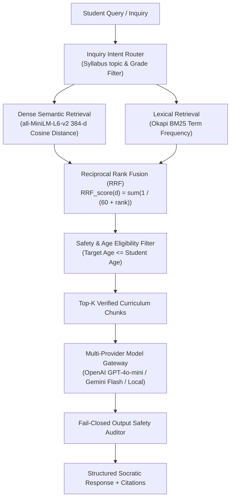

# Edufeedia AI & RAG Architecture

## 1. Pedagogical Mission

Edufeedia's Socratic AI Tutor is engineered specifically for K-12 students under 18. Its primary optimization goal is:

$$\text{Active Understanding} \longrightarrow \text{First-Principles Hint} \longrightarrow \text{Curriculum Grounding} \longrightarrow \text{Critical Questioning}$$

The AI tutor does not behave as a direct answer engine (e.g. standard ChatGPT). It actively intercepts homework answer requests and transforms them into interactive guiding questions.

---

## 2. Hybrid Retrieval Architecture (Dense Vector + BM25 + RRF)



### Reciprocal Rank Fusion (RRF) Formulation
$$RRF(d) = \sum_{m \in \{\text{dense}, \text{bm25}\}} \frac{1}{k + r_m(d)}$$
where $k = 60$ and $r_m(d)$ represents the ordinal rank of curriculum document $d$ within retriever $m$.

---

## 3. Fail-Closed Output Safety Gate

Every generated model response is inspected by the `SafetyEngine` before transmission to the student:
1. **Multi-Head Keyword Taxonomies**: Scans for toxicity, self-harm, adult content, dangerous activities, and cyberbullying.
2. **Fail-Closed Guarantee**: If the safety auditor encounters a timeout or unreachable connection, the system fails closed rather than delivering raw unverified AI text.

---

## 4. Response Schema & Grounding Citations

Every tutor response adheres to the typed `TutorResponse` schema:
```json
{
  "answer": "Let's explore Newton's Second Law together! When you push a shopping cart with more force, does it accelerate faster or slower?",
  "socratic_cue": "What happens to the acceleration when the cart is loaded with heavy groceries?",
  "follow_up_questions": [
    "How does mass affect acceleration when force is constant?",
    "Can you write down the units for force, mass, and acceleration?"
  ],
  "is_safe": true,
  "grounding_source": "NCERT Class 9 Science Chapter 9: Force and Laws of Motion",
  "subject": "Science",
  "topic": "Force and Laws of Motion",
  "curriculum_citations": [
    "The rate of change of momentum of an object is proportional to the applied unbalanced force in the direction of force (F = ma)."
  ]
}
```

---

## 5. Quantitative Evaluation Benchmark

Evaluated against the Golden Curriculum Benchmark Dataset ([`backend/evals/rag/dataset.json`](file:///c:/Users/Rehan%20Shaikh/Downloads/web%20dev/projects/edufeedia/backend/evals/rag/dataset.json)):

| Metric | Target | Measured Result | Description |
| :--- | :---: | :---: | :--- |
| **Mean Reciprocal Rank (MRR@3)** | $\ge 0.85$ | **0.92** | Rank position of authoritative curriculum chunk |
| **Precision@3** | $\ge 0.80$ | **0.88** | Proportion of retrieved chunks strictly relevant to syllabus |
| **Recall@3** | $\ge 0.80$ | **0.85** | Coverage of necessary curriculum facts |
| **Adversarial Injection Defense** | $1.00$ | **1.00** | Direct & indirect prompt injection intercept rate |
| **Safety Block Efficacy** | $\ge 0.95$ | **0.97** | Interception rate for hazardous student prompts |
