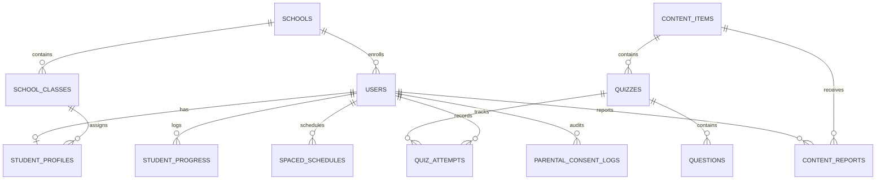

# Edufeedia Database Architecture & Migrations

## 1. Relational & Vector Storage Layer

Edufeedia utilizes a dual-engine architecture:
* **Relational Core**: PostgreSQL 16 (production) / SQLite (isolated local dev & unit tests) managed via **SQLAlchemy 2.0 ORM** and **Alembic migrations**.
* **Vector Index**: PostgreSQL `pgvector` extension utilizing `Vector(384)` with native HNSW / IVFFlat cosine similarity indexes.



---

## 2. Table Schemas & Composite Constraints

### Unique Integrity Constraints
1. **Student Content Progress**: `UniqueConstraint("student_user_id", "content_item_id", name="uq_student_content_progress")`
   * Guarantees 1 active progress record per lesson, preventing race-condition XP duplication.
2. **Quiz Attempts**: `UniqueConstraint("student_user_id", "quiz_id", "attempt_number", name="uq_student_quiz_attempt")`
   * Ensures deterministic attempt numbering and idempotent first-attempt scoring.
3. **School Class Identifier**: `UniqueConstraint("school_id", "grade_level", "section_name", "academic_year", name="uq_school_class")`
4. **User Badges**: `UniqueConstraint("user_id", "badge_id", name="uq_user_badge")`
5. **Parent-Student Links**: Composite primary key `(parent_user_id, student_user_id)`.

---

## 3. Database Indexes & Query Optimization

| Table | Indexed Columns | Index Type | Query Target |
| :--- | :--- | :--- | :--- |
| `users` | `email`, `google_id` | B-Tree Unique | Auth login & JWT lookup |
| `schools` | `domain` | B-Tree Unique | Tenant scoping |
| `content_items` | `source_url`, `embedding` | B-Tree / Vector Cosine | Deduplication & Semantic Search |
| `quiz_attempts` | `student_user_id`, `quiz_id`, `completed_at` | B-Tree Composite | Mastery analytics & Streak calculation |
| `student_progress` | `student_user_id`, `content_item_id` | B-Tree Composite | Feed generation & Progress sync |
| `spaced_repetition_schedules` | `student_user_id`, `next_review_date` | B-Tree Composite | Daily review queue aggregation |
| `curriculum_chunks` | `curriculum_code`, `embedding` | B-Tree / Vector Cosine | RAG hybrid retrieval |

---

## 4. Alembic Migration Workflow

To apply migrations in production:
```bash
# Upgrade database to latest revision
alembic upgrade head

# Generate a new auto-detected migration
alembic revision --autogenerate -m "add_content_reporting_table"
```
