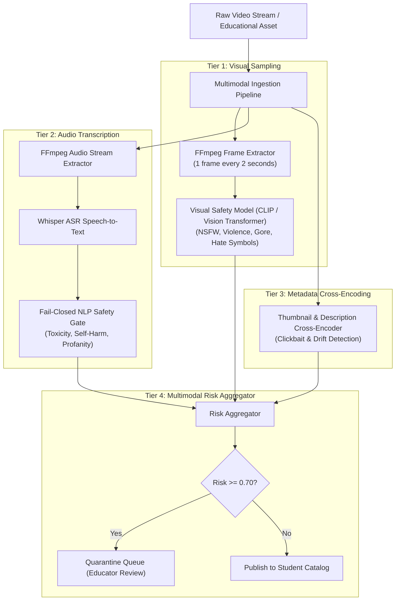

# Edufeedia Device-Level Protection & Multimodal Moderation Architecture

> **Architecture Specification & Strategic Roadmap**  
> This document specifies the architectural design for extending Edufeedia from a **curated web application** (Phase 1) into a **comprehensive digital child-safety ecosystem** (Phases 2-4).

---

## 1. The Strategic Product Evolution

```
+---------------------------------------------------------------------------------------------+
| PHASE 1: WEB-BASED MVP (COMPLETED & HARDENED)                                               |
| Student -> Safe Feed -> Content Player -> AI Socratic Tutor -> Adaptive Quiz -> Topic       |
| Mastery -> Parent Dashboard & Screen Time Controls                                          |
+-----------------------------------------------+---------------------------------------------+
                                                |
                                                v
+---------------------------------------------------------------------------------------------+
| PHASE 2: DEVICE-LEVEL PROTECTION & SAFE SHELL (NEXT MILESTONE)                              |
| Android Native Shell + Safe Browser + Local VPN/DNS Filter + Device App Gating + Curfew     |
+-----------------------------------------------+---------------------------------------------+
                                                |
                                                v
+---------------------------------------------------------------------------------------------+
| PHASE 3: ADVANCED MULTIMODAL SAFETY PIPELINE                                                |
| Video Frame Sampling + Whisper Audio ASR + Thumbnail Scoring + Human Moderation Console     |
+-----------------------------------------------+---------------------------------------------+
                                                |
                                                v
+---------------------------------------------------------------------------------------------+
| PHASE 4: SCALE & ENTERPRISE GOVERNANCE                                                      |
| Indic Language Safety Benchmarks + Multi-Board Sync + Native Parent/Teacher Mobile Apps    |
+---------------------------------------------------------------------------------------------+
```

---

## 2. Phase 2: Device-Level Protection Architecture

### 2.1 The Architectural Boundary Challenge

Currently, Edufeedia enforces fail-closed safety and Socratic tutoring within its own application perimeter:
$$\\text{Child} \\longrightarrow \\text{Edufeedia Web Client} \\longrightarrow \\text{Safety Gateway} \\longrightarrow \\text{Curated Content}$$

To prevent minors from bypassing safeguards by simply opening another browser tab, social media app, or uncurated video streaming platform, Edufeedia's Phase 2 introduces a **Device-Level Protection Layer**:

```mermaid
flowchart TD
    Internet["Open Internet Traffic"] --> OS["Child Device Operating System"]
    
    subgraph Device Protection Boundary
        OS --> VPN["Edufeedia Local VPN / DNS Interceptor
(Android VpnService)"]
        VPN --> PolicyCheck{"Domain Policy Engine"}
        PolicyCheck -->|Curated Educational (CBSE, NCERT, Khan)| Allowed["Allowed Traffic"]
        PolicyCheck -->|Social Media / Distraction / Unsafe| Sinkhole["Blocked (Sinkhole 0.0.0.0)"]
        
        OS --> AppMonitor["Edufeedia Device Shell & App Gating
(UsageStatsManager & AccessibilityService)"]
        AppMonitor --> AppCheck{"App Category & Curfew Check"}
        AppCheck -->|During Study Hours & Curfew| AppLock["Overlay Lock Screen"]
        AppCheck -->|Approved Educational App| AppLaunch["Launch App"]
    end

    Allowed --> SafeBrowser["Edufeedia Safe Browser & Player"]
    SafeBrowser --> Core["Edufeedia Backend Core"]
```

---

### 2.2 Android `VpnService` / Local DNS Filtering Engine

The device protection agent runs as a background service on the minor's device without requiring a remote third-party VPN server:

1. **Loopback TUN Interface**: Employs Android `VpnService` to capture outbound port 53 (DNS) and port 853 / DoH (DNS-over-HTTPS) packets locally.
2. **Deterministic Whitelist-First Resolution**:
   - Allowed list: Verified educational domains, school LMS endpoints, and whitelisted CDNs.
   - Denied list: Algorithmic social media platforms, short-form video feeds, adult/gambling domains, and proxy/VPN bypass tunnels.
3. **Enforced SafeSearch**:
   - Automatically rewrites search engine queries (Google, Bing, YouTube) to append `safe=active` and restrict search parameters at the network packet level.

---

### 2.3 Safe Browser Sandbox & Application Gating

1. **Dedicated Educational Webview**:
   - Disables incognito mode, third-party browser extensions, and arbitrary file downloads.
   - Enforces certificate pinning to prevent SSL inspection tampering.
2. **App Usage & Curfew Enforcement**:
   - Uses Android `UsageStatsManager` to aggregate daily screen time across third-party non-educational applications.
   - When the parent's **Bedtime Curfew** (e.g. `21:30 - 06:30`) or **Daily Screen Time Limit** is reached, an interactive screen lock is rendered with a rest reminder.

---

## 3. Phase 3: Multimodal Moderation Pipeline

### 3.1 Limitations of Metadata-Only Safety

Text-based metadata inspection (titles, tags, descriptions) cannot detect:
- Incongruent video content (e.g., educational title with unsafe background imagery).
- Mid-video topic drift or toxic verbal audio commentary.
- Adversarial visual symbols embedded in video frames.

---

### 3.2 4-Tier Multimodal Ingestion Architecture



---

### 3.3 Composite Multimodal Risk Scoring Formula

The aggregate safety score $S_{risk} \in [0, 1]$ is computed as:

$$S_{risk} = 0.45 \cdot \max_{i=1..N}(S_{visual, i}) + 0.35 \cdot \left(\frac{1}{M}\sum_{j=1}^{M} S_{audio, j}\right) + 0.20 \cdot S_{metadata}$$

Where:
- $\max(S_{visual, i})$: The maximum violation score across all sampled video frames.
- $\bar{S}_{audio}$: The average toxicity score across timestamped transcript segments.
- $S_{metadata}$: The semantic divergence score between title/tags and actual audio-visual content.

**Action Thresholds**:
- $S_{risk} < 0.25$: Automatic approval & indexing into curriculum vector store.
- $0.25 \le S_{risk} < 0.70$: High-scrutiny staging (requires 2 verified educator upvotes).
- $S_{risk} \ge 0.70$: Immediate fail-closed quarantine and notification to content operations.

---

## 4. Phase 4: Scale, Multilingual Benchmarks & Operations

1. **Multilingual & Indic Language Safety Benchmark**:
   - Comprehensive test dataset covering Hindi, Hinglish, regional Indian dialects, colloquial teen slang, and code-switching adversarial prompts.
2. **Human-in-the-Loop Moderation Console**:
   - Role-based queue for platform moderators to review quarantined videos with timestamp-synced violation annotations.
3. **Cross-Platform Mobile Ecosystem**:
   - Native Flutter / React Native mobile applications for Parents (real-time screen time notifications, one-click curfew override) and Students (offline flashcard spaced repetition).
