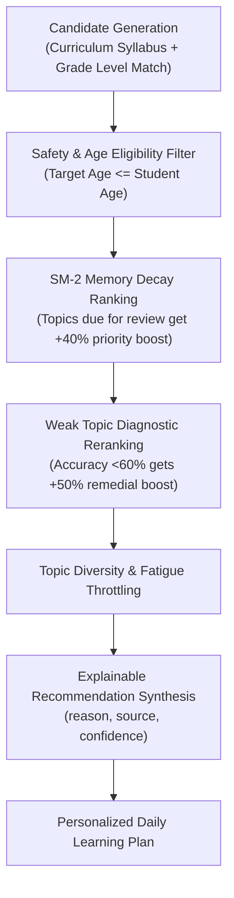

# Edufeedia Recommendation & Personalization Engine

## 1. Core Optimization Goal

Edufeedia's recommendation ranker optimizes for **long-term learning mastery and memory retention**, not infinite addictive engagement or click-through maximization.



---

## 2. Recommendation Signals & Weightings

The ranker evaluates items based on:
1. **Weak Topic Recovery (+50% Boost)**: Topics where recent quiz accuracy dropped below 60%.
2. **Spaced Repetition Schedule (+40% Boost)**: Topics where the SuperMemo SM-2 interval dictates review is due today.
3. **Curriculum Progression**: Sequential mastery along the CBSE/NCERT syllabus graph.
4. **Cold-Start Strategy**: For new students with zero history, recommendations strictly follow foundational curriculum benchmarks without inventing fake interests.

---

## 3. Explainability Architecture

Every recommended lesson includes transparent pedagogical provenance:

```json
{
  "title": "Quadratic Equations — Nature of Roots",
  "subject": "Mathematics",
  "topic": "Quadratic Equations",
  "score": 0.94,
  "reason": "Recommended because Quadratic Equations is currently a weak topic based on recent quiz performance.",
  "source": "weak_topic",
  "confidence": 0.89
}
```

### Supported Reason Taxonomies:
* `weak_topic`: Triggered by diagnostic quiz accuracy $<60\%$.
* `review_due`: Triggered by SM-2 spaced repetition decay curve.
* `curriculum_progression`: Sequential next lesson in classroom syllabus.
* `teacher_assignment`: Mandated by educator for class homework.
* `interest_match`: Optional student-selected interest topic.

---

## 4. Evaluation Metrics & Benchmark Dataset

Evaluated using [`backend/evals/recommender/dataset.json`](file:///c:/Users/Rehan%20Shaikh/Downloads/web%20dev/projects/edufeedia/backend/evals/recommender/dataset.json):

| Metric | Target | Description |
| :--- | :---: | :--- |
| **Weak-Topic Recovery Rate** | $\ge 70\%$ | Proportion of struggling students who improve accuracy $>75\%$ after remedial recommendations |
| **SM-2 Review Adherence** | $\ge 80\%$ | Student completion rate for spaced repetition flashcards on due dates |
| **Topic Diversity (NDCG@5)** | $\ge 0.85$ | Balance across subjects (Math, Science, Coding) preventing single-topic fatigue |
