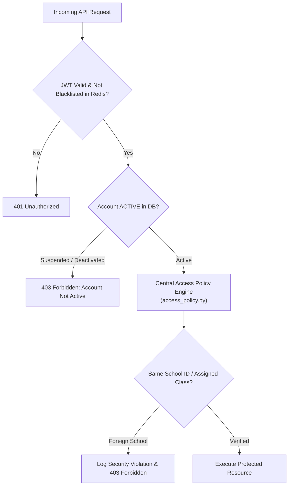

# Edufeedia Security Architecture & Access Control 🛡️

> For our vulnerability disclosure policy and private reporting channels, please see [SECURITY.md](../SECURITY.md).

## 1. Multi-Tenant Role-Based Access Control (RBAC)

Edufeedia isolates data boundaries strictly by tenant `school_id`:

---

## 2. Server-Derived Identity & Anti-IDOR Protections

1. **JWT Ownership**: All student interactions (`/content/progress`, `/quizzes/submit`, `/recommendations/feed`, `/students/profile`) strictly derive `student_id` from the server-validated JWT subject. Client-provided `student_id` fields in request bodies are ignored.
2. **Public Registration Stripping**: Self-registration enforces `school_id = None` and `class_id = None`, blocking untrusted school claim attacks.
3. **Onboarding Immutability**: Students cannot forge `school_id` during onboarding.

---

## 3. Quiz Answer Anti-Leakage Separation

* **Student View (`QuizOut`)**: Delivers `id`, `question_text`, `options`, `difficulty`. `correct_answer` and `explanation` are omitted prior to submission.
* **Educator View (`QuizTeacherOut`)**: Delivers full authoritative answer keys, rubrics, and explanations.

---

## 4. Cryptographic Token & Session Management

* **Stateless JWT with Redis Blacklist**: Instant session revocation on logout.
* **Algorithm Hardening**: Rejects `alg: "none"` or mismatched algorithm confusion payloads.
* **Rate Limiting**: Sliding-window rate limiting on login, registration, and OTP request routes.
